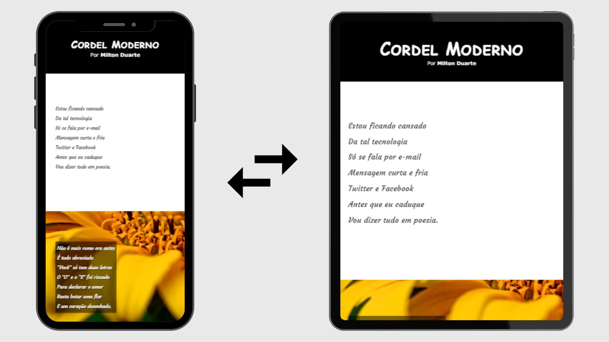

# Projeto Cordel

## Um site com um cordel usando a tecnologia Parallax

Este é um site, sobre um cordel de Milton Duarte, onde pude abordar a estrutura de um cordel com imagens de fundo com efeito parallax.

<a href="https://joselucas77.github.io/projeto-cordel/">🔗 Acesse aqui o projeto</a>

## Tecnologias ultilizadas e informações adicionais

- HTML e CSS
- Site Responsivo
